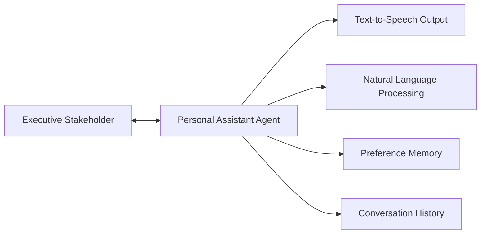
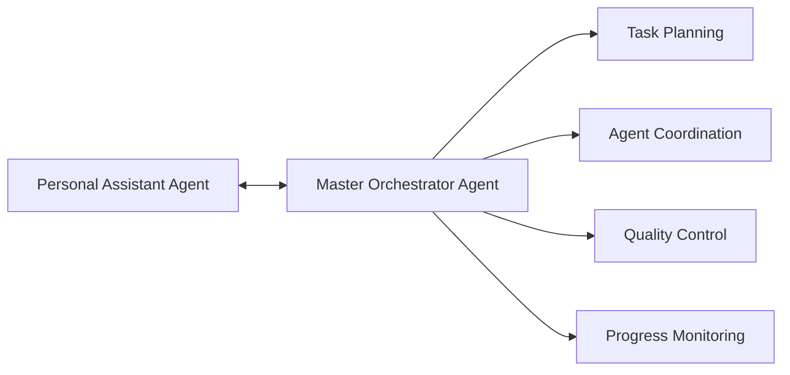
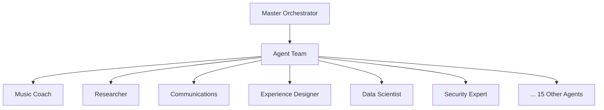

# Executive Stakeholder Interface Design Specification

**Document Version:** 1.0  
**Created:** September 4, 2025  
**Primary Interface Agent:** Personal Assistant Agent  
**Coordination Agent:** Master Orchestrator Agent  
**Executive Stakeholder:** Human Decision-Maker and System User  

---

## 📋 **Executive Summary**

The Executive Stakeholder Interface defines the comprehensive interaction model between the human decision-maker (Executive Stakeholder) and the AI Agent Team ecosystem. This design establishes the Personal Assistant Agent as the primary human interface, creating a natural, conversational, and highly personalized experience that leverages advanced natural language processing, text-to-speech capabilities, and continuous learning to provide an exceptional AI assistance experience.

---

## 🎯 **Interface Architecture Philosophy**

### **Core Design Principles**

#### **Single Point of Contact**
The Executive Stakeholder interacts exclusively with the Personal Assistant Agent, which serves as:
- **Conversational Interface**: Natural language communication hub
- **Preference Learning System**: Continuous adaptation to ES communication style and needs  
- **Project Coordination Gateway**: Bridge between human requests and technical execution
- **Relationship Manager**: Maintains context, history, and personal connection

#### **Human-Centric Experience Design**
```typescript
interface HumanCentricDesign {
  naturalCommunication: {
    conversationalTone: "Professional yet approachable, adaptive to ES style";
    contextAwareness: "Remembers previous conversations and preferences";
    emotionalIntelligence: "Recognizes frustration, excitement, urgency in communication";
    proactiveAssistance: "Anticipates needs based on patterns and context";
  };
  
  personalizedExperience: {
    learningStyle: "Adapts explanations to ES preferred learning methods";
    communicationPreferences: "Matches ES communication style and formality level";
    workingPatterns: "Understands ES schedule and availability preferences";
    projectApproach: "Aligns with ES decision-making and review processes";
  };
  
  trustBuilding: {
    transparency: "Clear explanation of what agents are doing and why";
    reliability: "Consistent quality and follow-through on commitments";
    competence: "Demonstrates deep knowledge and capability";
    advocacy: "Acts in ES best interests, not just system efficiency";
  };
}
```

---

## 🏗️ **Interface Architecture**

### **Three-Tier Communication Model**

#### **Tier 1: Executive Stakeholder ↔ Personal Assistant**


**Responsibilities:**
- Direct communication with Executive Stakeholder
- Natural language understanding and generation
- Preference learning and adaptation
- Context maintenance across sessions
- Voice interface (text-to-speech/speech-to-text)
- Emotional intelligence and relationship management

#### **Tier 2: Personal Assistant ↔ Master Orchestrator**


**Responsibilities:**
- Translation of ES requests into technical project specifications
- Project planning and resource allocation
- Agent team coordination and management
- Quality assurance and deliverable review
- Timeline management and progress reporting

#### **Tier 3: Master Orchestrator ↔ Agent Team**


**Responsibilities:**
- Specialized task execution
- Domain expertise application
- Deliverable creation
- Knowledge synthesis
- Quality output generation

---

## 🎤 **Natural Language Interface Specification**

### **Voice and Text Communication Framework**

#### **Text-to-Speech Integration**
```typescript
interface TTSConfiguration {
  // Voice characteristics
  voiceProfile: {
    personality: "Professional, warm, intelligent assistant";
    tone: "Conversational but knowledgeable";
    pace: "Moderate, adjustable to ES preference";
    clarity: "Crystal clear articulation for technical terms";
  };
  
  // Adaptive speech patterns
  adaptiveFeatures: {
    formalityLevel: "Matches ES communication style";
    technicalDepth: "Adjusts complexity to ES expertise level";
    urgencyResponse: "Faster pace for urgent requests";
    enthusiasmMatching: "Energy level aligned with ES engagement";
  };
  
  // Technical specifications
  technicalSpecs: {
    provider: "ElevenLabs premium voice generation";
    voiceModel: "Natural, professional female or male voice (ES preference)";
    outputQuality: "Studio quality audio (48kHz, 24-bit)";
    responseLatency: "<2 seconds for short responses";
    contextAwareness: "Adjusts tone based on conversation context";
  };
}
```

#### **Natural Language Understanding**
```typescript
interface NLUCapabilities {
  // Intent recognition
  intentAnalysis: {
    requestClassification: "Project creation, information inquiry, feedback provision";
    urgencyDetection: "Immediate, soon, eventual timeline recognition";
    scopeAssessment: "Simple task vs. complex multi-agent project";
    emotionalContext: "Frustration, excitement, confusion detection";
  };
  
  // Context management
  contextualUnderstanding: {
    conversationHistory: "Multi-session context preservation";
    projectContinuity: "Understanding references to previous work";
    implicitRequests: "Understanding unstated but implied needs";
    ambiguityResolution: "Intelligent clarification of unclear requests";
  };
  
  // Preference learning
  preferenceLearning: {
    communicationStyle: "Formal, casual, technical, creative preferences";
    projectApproach: "Detailed planning vs. quick iteration preferences";
    feedbackStyle: "Direct, supportive, comprehensive feedback preferences";
    learningStyle: "Visual, auditory, hands-on learning preferences";
  };
}
```

### **Conversation Flow Management**

#### **Request Processing Workflow**
```typescript
interface ConversationWorkflow {
  // Initial request reception
  requestReception: {
    listeningMode: "Active listening with contextual understanding";
    clarificationProcess: "Intelligent follow-up questions when needed";
    requestSummary: "Confirms understanding before proceeding";
    timelineDiscussion: "Establishes expectations and deadlines";
  };
  
  // Project coordination
  projectCoordination: {
    taskBreakdown: "Explains how request will be approached";
    agentIntroduction: "Introduces which agents will be involved";
    progressUpdates: "Regular check-ins during project execution";
    qualityAssurance: "Reviews outputs before presentation";
  };
  
  // Results presentation
  resultsPresentation: {
    contextualPresentation: "Explains deliverable in context of original request";
    highlightFeatures: "Points out key features and capabilities";
    usageGuidance: "Explains how to use and apply the deliverable";
    feedbackInvitation: "Actively solicits feedback and improvement suggestions";
  };
  
  // Feedback integration
  feedbackIntegration: {
    feedbackReception: "Active listening to ES feedback";
    impactAssessment: "Evaluates scope of requested changes";
    revisionPlanning: "Plans improvement approach with agent team";
    iterativeImprovement: "Manages multiple revision cycles";
  };
}
```

---

## 🔄 **Iterative Improvement Framework**

### **Executive Stakeholder Feedback Processing System**

#### **Feedback Classification and Routing**
```typescript
interface FeedbackProcessingSystem {
  // Feedback type identification
  feedbackTypes: {
    contentAddition: {
      description: "ES requests additional information or capabilities";
      routingAgent: "Master Orchestrator coordinates additional research/content";
      timeline: "Immediate to medium-term depending on scope";
      example: "Can you also add historical context about New Orleans music?";
    };
    
    styleModification: {
      description: "Changes to presentation style or communication approach";
      routingAgent: "Communications Agent handles style adjustments";
      timeline: "Quick turnaround, usually same session";
      example: "Can you make this more technical/less technical?";
    };
    
    scopeExpansion: {
      description: "Broadening the project beyond original request";
      routingAgent: "Master Orchestrator assesses resource requirements";
      timeline: "Medium-term, may require additional agent coordination";
      example: "This is great! Can you also cover guitar techniques?";
    };
    
    formatPreference: {
      description: "Changes to deliverable format or structure";
      routingAgent: "Experience Designer handles format modifications";
      timeline: "Quick to medium, depending on complexity";
      example: "Could this be in video format instead of document?";
    };
    
    difficultyAdjustment: {
      description: "Making content easier or more challenging";
      routingAgent: "Relevant domain expert (e.g., Music Coach) adjusts content";
      timeline: "Medium-term, requires content restructuring";
      example: "This is too advanced - I need more basic concepts first";
    };
  };
  
  // Processing workflow
  processingWorkflow: {
    reception: "Personal Assistant receives and acknowledges feedback";
    classification: "AI analysis determines feedback type and scope";
    planning: "Master Orchestrator creates revision strategy";
    coordination: "Appropriate agents assigned revision tasks";
    execution: "Agents implement requested changes";
    integration: "Master Orchestrator ensures cohesive final product";
    presentation: "Personal Assistant presents improved deliverable";
    validation: "Confirms ES satisfaction with improvements";
  };
}
```

#### **Continuous Learning Integration**
```typescript
interface ContinuousLearningSystem {
  // Personal Assistant learning
  personalAssistantLearning: {
    communicationPatterns: "Learns ES communication preferences and style";
    requestPatterns: "Identifies common request types and preferences";
    satisfactionFactors: "Understands what makes ES most satisfied";
    frustrationTriggers: "Recognizes and avoids ES frustration points";
  };
  
  // System-wide improvement
  systemLearning: {
    workflowOptimization: "Improves project coordination based on feedback";
    qualityEnhancement: "Raises quality standards based on ES expectations";
    capabilityExpansion: "Adds new capabilities based on ES requests";
    agentDevelopment: "Improves individual agent performance";
  };
  
  // Predictive assistance
  predictiveCapabilities: {
    needAnticipation: "Proactively suggests relevant additional work";
    preferenceApplication: "Applies learned preferences to new projects";
    contextualSuggestions: "Offers relevant suggestions based on current work";
    opportunityIdentification: "Suggests ways to expand or improve current projects";
  };
}
```

---

## 🎵 **New Orleans Piano Masterclass - Interface Specification**

### **Scenario-Specific Interface Design**

#### **Initial Request Processing**
```typescript
interface NewOrleansPianoRequest {
  // ES request: "Please create me a master class for New Orleans Piano that Dr. John plays in this song [YouTube link]"
  
  requestAnalysis: {
    personalAssistant: {
      initialResponse: "I'd love to help you create a comprehensive New Orleans piano masterclass! This is exactly the kind of creative learning project our Music Coach excels at.";
      clarificationQuestions: [
        "What's your current piano skill level so I can tailor the instruction appropriately?",
        "Are you more interested in learning to play like Dr. John specifically, or New Orleans style in general?",
        "Would you prefer a written guide, video content, or a combination?",
        "How much time are you planning to dedicate to learning this style?"
      ];
      expectationSetting: "I'll have our Music Coach analyze the song and style, while our Research team gathers background on Dr. John and New Orleans piano tradition. Expect a comprehensive masterclass that covers theory, technique, and practical application.";
    };
    
    projectCoordination: {
      agentTeamIntroduction: "I'm coordinating with our Music Coach for the core instruction, Research Agent for historical context, Communications Agent for clear explanations, and Experience Designer for beautiful presentation.";
      timelineEstimate: "I expect to have a preliminary masterclass ready in 2-3 hours, with refinements based on your feedback.";
      deliverablePreview: "You'll receive a comprehensive guide including music theory, chord progressions, practice exercises, historical context, and curated learning resources.";
    };
  };
  
  progressCommunication: {
    regularUpdates: [
      "Our Music Coach is analyzing the New Orleans piano style characteristics...",
      "Research Agent has found fascinating historical context about Dr. John's influences...",
      "The team is creating practice exercises tailored to your skill level...",
      "Experience Designer is formatting everything into a beautiful, easy-to-follow guide..."
    ];
    challengeTransparency: "I should mention that analyzing audio from YouTube requires careful listening - our Music Coach is being thorough to ensure accuracy.";
    qualityAssurance: "I'm reviewing everything to make sure it meets the high standard you expect.";
  };
}
```

#### **Results Presentation Interface**
```typescript
interface ResultsPresentation {
  deliverableIntroduction: {
    contextualFramework: "I'm excited to present your New Orleans Piano Masterclass! Our team has created something really special that captures both the technical aspects of Dr. John's style and the cultural richness of New Orleans music.";
    
    highlightedFeatures: [
      "Comprehensive analysis of the specific song you provided",
      "Progressive learning exercises from beginner to advanced concepts",
      "Historical context that will deepen your appreciation of the style",
      "Practice audio tracks to help you develop the authentic groove",
      "Curated resources for continued learning"
    ];
    
    personalizedElements: "I've made sure everything is presented at your skill level, with clear explanations and practical applications you can start using immediately.";
  };
  
  usageGuidance: {
    recommendedApproach: "I suggest starting with the historical context to understand the style, then working through the technical exercises progressively. The practice tracks will help you develop that authentic New Orleans groove.";
    
    practiceRecommendations: "Plan on 30-45 minutes per session, focusing on one concept at a time. The muscle memory for this style takes time to develop, so consistency is more important than long practice sessions.";
    
    successMetrics: "You'll know you're getting it when the left-hand patterns feel natural and you can hear that characteristic New Orleans swing in your playing.";
  };
  
  feedbackInvitation: {
    openEndedInquiry: "What do you think? Does this capture what you were looking for?";
    
    specificFeedbackAreas: [
      "Is the difficulty level appropriate for your current skills?",
      "Would you like more focus on any particular aspect (theory, technique, history)?",
      "Are there other Dr. John songs you'd like me to analyze similarly?",
      "How would you like to expand this into other New Orleans piano styles?"
    ];
    
    iterationWillingness: "I'm ready to refine this based on your feedback - this is just the beginning of what we can create together!";
  };
}
```

#### **Feedback Processing and Iteration**
```typescript
interface FeedbackIteration {
  // Example ES feedback scenarios
  feedbackScenarios: {
    contentExpansion: {
      esFeedback: "This is fantastic! Can you also add left-hand bass patterns and maybe some gospel influence?";
      
      personalAssistantResponse: "Absolutely! I love that you want to dive deeper. Our Music Coach can definitely expand the left-hand techniques - New Orleans piano has such rich bass patterns. And the gospel influence is crucial to understanding Dr. John's style.";
      
      coordinationResponse: "I'll have our Music Coach focus on stride piano and boogie-woogie bass patterns, plus the gospel chord voicings that are so characteristic of New Orleans style. Should have these additions ready within an hour.";
    };
    
    styleAdjustment: {
      esFeedback: "The content is great but could you make the explanations less technical? I learn better with practical examples.";
      
      personalAssistantResponse: "Of course! I want this to match your learning style perfectly. Let me have our Communications Agent rework the explanations to be more hands-on and example-focused.";
      
      implementationResponse: "We'll replace technical theory with practical 'try this' examples and audio demonstrations. The Music Coach will create more play-along exercises so you can hear and feel the concepts rather than just reading about them.";
    };
    
    scopeExpansion: {
      esFeedback: "I'm really excited about this! Could we also explore other New Orleans piano players like Professor Longhair?";
      
      personalAssistantResponse: "What a great idea! Professor Longhair is legendary - his influence on New Orleans piano is enormous. This would make an excellent follow-up masterclass.";
      
      planningResponse: "I'll have our Research Agent compile information on Professor Longhair's style and our Music Coach analyze the differences and similarities with Dr. John. We could create a whole series of New Orleans piano masterclasses!";
    };
  };
  
  learningIntegration: {
    preferenceStorage: "ES prefers practical, hands-on learning over theoretical explanations";
    engagementPattern: "Gets excited about expanding scope when initial deliverable exceeds expectations";
    learningStyle: "Audio examples and practice exercises more effective than written theory";
    futurePlanning: "Interest in comprehensive exploration of related topics and artists";
  };
}
```

---

## 🔧 **Technical Implementation Specifications**

### **Personal Assistant Agent Core Architecture**

#### **Natural Language Processing Engine**
```typescript
interface NLPEngine {
  // Core NLP capabilities
  languageUnderstanding: {
    intentRecognition: "OpenAI GPT-4 for complex intent analysis";
    entityExtraction: "Named entity recognition for projects, people, concepts";
    sentimentAnalysis: "Emotional state detection and appropriate response";
    contextualMemory: "Long-term conversation history and preference storage";
  };
  
  // Response generation
  responseGeneration: {
    conversationalAI: "GPT-4 fine-tuned for personal assistant role";
    personalityConsistency: "Maintained personality traits across interactions";
    contextualRelevance: "Responses that build on conversation history";
    emotionalIntelligence: "Appropriate emotional tone and empathy";
  };
  
  // Learning capabilities
  adaptiveLearning: {
    preferenceModeling: "Machine learning models for ES preference prediction";
    communicationStyleAdaptation: "Dynamic adjustment to match ES communication patterns";
    successPattern: "Recognition of what types of responses ES finds most helpful";
    frustrationPrevention: "Proactive identification and avoidance of frustration triggers";
  };
}
```

#### **Voice Interface Integration**
```typescript
interface VoiceInterface {
  // Text-to-Speech capabilities
  textToSpeech: {
    provider: "ElevenLabs premium voice synthesis";
    voiceCharacteristics: {
      personality: "Warm, professional, intelligent assistant";
      consistency: "Same voice personality across all interactions";
      adaptability: "Tone adjustment based on context and ES mood";
      clarity: "Crystal clear pronunciation of technical terms";
    };
    performance: {
      latency: "<2 seconds for typical responses";
      quality: "Studio-grade audio output";
      naturalness: "Human-like intonation and rhythm";
      customization: "Voice speed and style preferences";
    };
  };
  
  // Speech-to-Text capabilities (optional)
  speechToText: {
    provider: "OpenAI Whisper or Google Speech API";
    capabilities: {
      accuracyRate: ">95% for clear speech";
      languageSupport: "Multiple languages and accents";
      noiseHandling: "Background noise filtering";
      realTimeProcessing: "Live transcription during conversation";
    };
  };
  
  // Multimodal interaction
  multimodalCapabilities: {
    voiceAndText: "Seamless switching between voice and text communication";
    visualSupport: "Screen sharing and visual aid presentation";
    documentHandling: "Voice commands for document navigation and editing";
    multitasking: "Voice interaction while working with other applications";
  };
}
```

### **Agent Coordination Infrastructure**

#### **Master Orchestrator Integration**
```typescript
interface OrchestratorIntegration {
  // Project planning
  projectManagement: {
    taskBreakdown: "Automated decomposition of ES requests into agent tasks";
    resourceAllocation: "Optimal assignment of agents based on capabilities and availability";
    timelineManagement: "Realistic scheduling and deadline management";
    dependencyTracking: "Managing inter-agent dependencies and coordination";
  };
  
  // Quality assurance
  qualityControl: {
    outputReview: "Systematic review of all agent outputs before ES presentation";
    coherenceChecking: "Ensuring consistency across multi-agent deliverables";
    standardCompliance: "Adherence to established quality standards";
    improvementTracking: "Continuous improvement based on ES feedback";
  };
  
  // Progress monitoring
  progressTracking: {
    realTimeStatus: "Live updates on project progress across all agents";
    bottleneckIdentification: "Early detection of delays or issues";
    resourceOptimization: "Dynamic reallocation of resources as needed";
    communicationManagement: "Coordinated updates to ES through Personal Assistant";
  };
}
```

#### **Agent Communication Protocol**
```typescript
interface AgentCommunication {
  // Inter-agent messaging
  messagingFramework: {
    taskAssignment: "Clear specification of tasks and deliverables";
    progressReporting: "Regular status updates and milestone completion";
    knowledgeSharing: "Cross-agent knowledge and resource sharing";
    qualityFeedback: "Peer review and improvement suggestions";
  };
  
  // Collaboration protocols
  collaborationStandards: {
    documentStandards: "Consistent formatting and structure across agents";
    dataSharing: "Standardized data formats for knowledge exchange";
    versionControl: "Systematic management of document versions and changes";
    conflictResolution: "Procedures for handling conflicting recommendations";
  };
  
  // Escalation procedures
  escalationManagement: {
    issueIdentification: "Early detection of problems or conflicts";
    escalationPaths: "Clear procedures for issue resolution";
    fallbackStrategies: "Alternative approaches when primary methods fail";
    qualityAssurance: "Ensuring ES requirements are met despite challenges";
  };
}
```

---

## 📊 **Success Metrics and Performance Indicators**

### **Executive Stakeholder Satisfaction Metrics**

#### **Immediate Interaction Quality**
```typescript
interface InteractionQuality {
  // Communication effectiveness
  communicationMetrics: {
    responseRelevance: "How well responses address ES requests and concerns";
    clarityRating: "Clarity and understandability of explanations";
    completenessScore: "Thoroughness in addressing all aspects of requests";
    timeliness: "Appropriate response speed for different types of requests";
  };
  
  // Emotional connection
  relationshipMetrics: {
    trustLevel: "ES confidence in agent capabilities and recommendations";
    comfortLevel: "Ease and naturalness of communication";
    engagementQuality: "Level of interest and engagement in interactions";
    satisfactionRating: "Overall satisfaction with interaction experience";
  };
  
  // Practical effectiveness
  effectivenessMetrics: {
    problemSolution: "Success rate in solving ES problems and challenges";
    valueDelivery: "Perceived value of deliverables and assistance";
    timeEfficiency: "Time savings achieved through agent assistance";
    goalAchievement: "Success in helping ES achieve stated objectives";
  };
}
```

#### **Long-Term Relationship Development**
```typescript
interface LongTermRelationship {
  // Learning and adaptation
  adaptationMetrics: {
    preferenceAccuracy: "Accuracy in predicting and meeting ES preferences";
    styleMaintenance: "Consistency in maintaining preferred communication style";
    improvementRate: "Speed of learning and implementing ES feedback";
    anticipationSuccess: "Accuracy in proactively addressing ES needs";
  };
  
  // Value creation
  valueMetrics: {
    productivityIncrease: "Measurable improvement in ES productivity";
    learningAcceleration: "Faster achievement of ES learning objectives";
    creativityEnhancement: "Support for ES creative and innovative projects";
    stressReduction: "Reduction in ES stress through effective assistance";
  };
  
  // Relationship depth
  relationshipDepth: {
    trustEvolution: "Deepening trust and reliance over time";
    communicationNaturalness: "Increasing naturalness and ease of interaction";
    collaborationQuality: "Evolution toward true collaborative partnership";
    systemIntegration: "Integration into ES daily workflow and decision-making";
  };
}
```

### **System Performance Metrics**

#### **Technical Performance**
```typescript
interface TechnicalPerformance {
  // Response performance
  responseMetrics: {
    latency: "Speed of initial response to ES requests";
    processingTime: "Total time from request to deliverable completion";
    accuracyRate: "Correctness of understanding and response";
    consistencyScore: "Reliability across different types of interactions";
  };
  
  // System reliability
  reliabilityMetrics: {
    uptime: "System availability and accessibility";
    errorRate: "Frequency of system errors or failures";
    recoveryTime: "Speed of recovery from errors or issues";
    dataIntegrity: "Accuracy and consistency of stored information";
  };
  
  // Learning effectiveness
  learningMetrics: {
    adaptationSpeed: "Speed of learning new preferences and requirements";
    knowledgeRetention: "Long-term retention of learned information";
    improvementTrajectory: "Consistent improvement in performance over time";
    transferLearning: "Application of learning to new situations and contexts";
  };
}
```

---

## 🚀 **Implementation Roadmap**

### **Phase 1: Core Interface Development (Week 1)**

#### **Personal Assistant Foundation**
- [ ] **Basic Conversational AI**: Implement GPT-4 based natural language understanding and generation
- [ ] **Preference Storage System**: Database design for ES preference learning and storage
- [ ] **Master Orchestrator Integration**: Communication protocols between Personal Assistant and Master Orchestrator
- [ ] **Basic Memory Management**: Conversation history and context maintenance

#### **Initial Voice Capabilities**
- [ ] **Text-to-Speech Integration**: ElevenLabs integration with professional voice characteristics
- [ ] **Voice Personality Configuration**: Consistent, warm, professional assistant personality
- [ ] **Response Timing Optimization**: Sub-2-second response latency for typical interactions
- [ ] **Audio Quality Assurance**: Studio-grade output quality validation

### **Phase 2: Advanced Communication Features (Week 2)**

#### **Enhanced Natural Language Processing**
- [ ] **Advanced Intent Recognition**: Complex request parsing and understanding
- [ ] **Emotional Intelligence**: Sentiment analysis and appropriate emotional response
- [ ] **Context Management**: Long-term conversation history and reference capabilities
- [ ] **Clarification Protocols**: Intelligent follow-up question generation

#### **Learning and Adaptation Systems**
- [ ] **Preference Learning Engine**: Machine learning models for ES preference prediction
- [ ] **Communication Style Adaptation**: Dynamic adjustment to match ES communication patterns
- [ ] **Success Pattern Recognition**: Identification of most effective response types
- [ ] **Proactive Assistance**: Anticipatory suggestion generation

### **Phase 3: Multi-Agent Coordination (Week 3)**

#### **Agent Team Integration**
- [ ] **Task Distribution Framework**: Automated assignment of tasks to appropriate agents
- [ ] **Progress Monitoring System**: Real-time tracking of multi-agent project progress
- [ ] **Quality Assurance Integration**: Systematic review processes before ES presentation
- [ ] **Coordination Protocols**: Standardized inter-agent communication and collaboration

#### **Feedback Processing System**
- [ ] **Feedback Classification**: Automated categorization of ES feedback types
- [ ] **Revision Coordination**: Management of multi-agent revision workflows
- [ ] **Iterative Improvement**: Support for multiple revision cycles and refinements
- [ ] **Learning Integration**: Incorporation of feedback into system-wide learning

### **Phase 4: Scenario Testing and Optimization (Week 4)**

#### **New Orleans Piano Masterclass Integration Test**
- [ ] **End-to-End Workflow**: Complete test of ES scenario from request to final deliverable
- [ ] **Multi-Agent Coordination**: Validation of Music Coach, Research, Communications, and Experience Designer collaboration
- [ ] **Feedback Processing**: Testing of revision and improvement workflows
- [ ] **Quality Validation**: Confirmation of deliverable quality and ES satisfaction

#### **Performance Optimization**
- [ ] **Response Time Optimization**: Fine-tuning for optimal performance across all interaction types
- [ ] **Memory Efficiency**: Optimization of context and preference storage systems
- [ ] **Load Balancing**: Efficient distribution of processing across multiple agents
- [ ] **Error Handling**: Robust error detection, reporting, and recovery mechanisms

### **Success Criteria**

#### **Phase 1 Success Criteria**
- Personal Assistant responds naturally to basic requests
- Voice output is professional, clear, and engaging
- Master Orchestrator integration enables task coordination
- Basic conversation memory and context maintained

#### **Phase 2 Success Criteria**
- Complex requests are understood and parsed accurately
- Communication style adapts to ES preferences
- Emotional context is recognized and addressed appropriately
- Proactive suggestions demonstrate understanding of ES needs

#### **Phase 3 Success Criteria**
- Multi-agent projects are coordinated seamlessly
- ES receives regular, meaningful progress updates
- Feedback is processed efficiently with appropriate agent coordination
- Quality of multi-agent deliverables is consistently high

#### **Phase 4 Success Criteria**
- New Orleans Piano Masterclass scenario completes with high ES satisfaction
- Multiple feedback iterations are handled smoothly
- System demonstrates measurable learning and improvement
- Performance metrics meet or exceed established targets

---

## 📋 **Conclusion**

The Executive Stakeholder Interface represents the critical human-AI interaction layer that will determine the success of the entire AI Agent Team ecosystem. By establishing the Personal Assistant Agent as a sophisticated, emotionally intelligent, and continuously learning interface, the system creates a natural and powerful collaboration between human creativity and AI capability.

The three-tier architecture ensures that the Executive Stakeholder enjoys a seamless, personalized experience while benefiting from the full capabilities of the specialized agent team. The comprehensive feedback and learning systems ensure that the interface becomes increasingly effective over time, ultimately creating a truly collaborative partnership that enhances human creativity and productivity.

The successful implementation of this interface will establish a new standard for human-AI interaction, demonstrating how artificial intelligence can serve as a genuine collaborative partner rather than simply a tool or service provider.

**Document Status:** Complete and Ready for Implementation  
**Next Actions:** Begin Phase 1 Core Interface Development  
**Integration Priority:** Music Coach Agent coordination for New Orleans Piano Masterclass scenario
