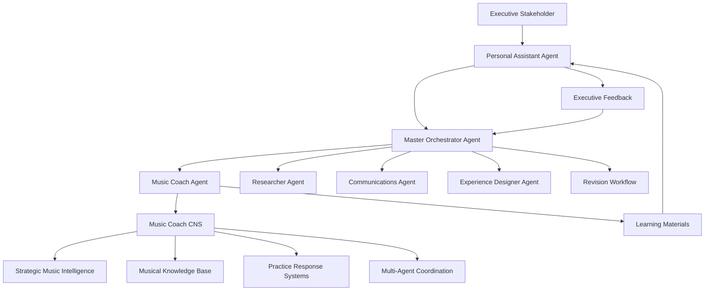

# Music Coach Agent - Comprehensive Design Specification

**Document Version:** 1.0  
**Created:** September 4, 2025  
**Agent ID:** #17 Music Coach Agent  
**Executive Stakeholder Interface:** Personal Assistant Agent  
**Project Coordination:** Master Orchestrator Agent  

---

## 📋 **Executive Summary**

The Music Coach Agent is a comprehensive AI-powered music education specialist designed to provide personalized instruction, theory education, and creative guidance across multiple instruments and musical styles. The agent serves as an expert music educator capable of analyzing musical content, creating structured learning experiences, and adapting to individual learning preferences through continuous improvement stored in its Central Nervous System (CNS).

---

## 🎯 **Strategic Objectives**

### **Primary Mission**
Transform music education through AI-powered personalized instruction, real-time analysis, and adaptive learning pathways that evolve with each student's progress and the Executive Stakeholder's expanding requirements.

### **Core Value Propositions**
1. **Personalized Education**: Adaptive learning paths based on skill level, instrument preference, and learning style
2. **Real-time Analysis**: Instant feedback on musical performance, chord progressions, and compositional choices
3. **Multi-Modal Learning**: Audio, visual, theoretical, and practical instruction methods
4. **Continuous Evolution**: CNS-based learning from each interaction to expand capabilities
5. **Professional-Grade Instruction**: Music theory depth equivalent to conservatory-level education

### **Success Metrics**
- **Educational Effectiveness**: Measurable skill progression in music theory, performance, and composition
- **Engagement Quality**: Sustained learning patterns and increasing complexity requests
- **Capability Expansion**: Documented growth in musical knowledge areas and teaching methods
- **Executive Satisfaction**: Alignment with ES learning objectives and musical exploration goals

---

## 🏗️ **System Architecture**

### **Executive Stakeholder Interface Model**



### **Agent Interaction Patterns**

#### **Request Processing Flow**
```typescript
interface MusicCoachWorkflow {
  // ES Request: "Create New Orleans Piano masterclass for Dr. John song"
  initialRequest: {
    source: "Executive Stakeholder";
    receiver: "Personal Assistant Agent";
    coordinator: "Master Orchestrator Agent";
    primaryExecutor: "Music Coach Agent";
    supportingAgents: ["Researcher Agent", "Communications Agent", "Experience Designer Agent"];
  };
  
  // Agent Coordination
  taskBreakdown: {
    musicCoach: [
      "Analyze New Orleans piano style characteristics",
      "Identify Dr. John's specific techniques and influences",
      "Create chord progression analysis of target song",
      "Design practice exercises and learning progression",
      "Generate musical notation and examples"
    ];
    researcher: [
      "Research Dr. John biography and musical influences",
      "Find historical context of New Orleans piano tradition",
      "Locate tutorial videos and educational resources"
    ];
    communications: [
      "Structure masterclass format and presentation",
      "Write clear explanations of musical concepts",
      "Create engaging educational narrative"
    ];
    experienceDesigner: [
      "Design document layout with musical notation",
      "Create visual learning aids and diagrams",
      "Optimize user experience for music learning"
    ];
  };
  
  // Iterative Improvement
  feedbackLoop: {
    presentation: "Personal Assistant presents deliverable to ES";
    feedback: "ES provides specific improvement requests";
    coordination: "Master Orchestrator coordinates revision tasks";
    execution: "Relevant agents execute improvements";
    learning: "Music Coach CNS stores new knowledge and preferences";
  };
}
```

### **Central Nervous System (CNS) Architecture**

#### **Brain: Strategic Music Intelligence**
```typescript
interface MusicCoachBrain {
  // Strategic Decision Making
  curriculumPlanning: {
    assessSkillLevel: (userInput: string) => SkillLevel;
    designLearningPath: (level: SkillLevel, goals: string[]) => LearningPath;
    adaptInstruction: (progress: ProgressData) => InstructionModifications;
  };
  
  // Musical Analysis Intelligence
  musicalAnalysis: {
    chordProgression: (chords: string[]) => ProgressionAnalysis;
    styleIdentification: (audioDescription: string) => MusicStyle;
    performanceFeedback: (userPerformance: PerformanceData) => Feedback;
  };
  
  // Creative Composition
  composition: {
    generateExercises: (concept: MusicConcept) => PracticeExercises;
    createProgressions: (style: MusicStyle, key: string) => ChordProgression[];
    designCurriculum: (objectives: LearningObjectives) => Curriculum;
  };
}
```

#### **Memory: Musical Knowledge Base**
```typescript
interface MusicCoachMemory {
  // Core Music Theory
  theoryKnowledge: {
    scales: Scale[];
    chords: ChordDefinition[];
    intervals: IntervalDefinition[];
    progressions: CommonProgression[];
    modes: ModeDefinition[];
  };
  
  // Style-Specific Knowledge
  musicalStyles: {
    jazz: JazzTheoryData;
    classical: ClassicalTheoryData;
    blues: BluesTheoryData;
    newOrleans: NewOrleansStyleData;
    pop: PopMusicData;
    rock: RockMusicData;
  };
  
  // Artist and Performance Data
  artistKnowledge: {
    drJohn: {
      techniques: Technique[];
      signature_progressions: ChordProgression[];
      historical_context: HistoricalData;
      influence_network: Artist[];
      learning_resources: Resource[];
    };
    // Expandable for other artists
  };
  
  // Executive Stakeholder Preferences
  esPreferences: {
    learning_style: LearningStyle;
    skill_progression: SkillHistory[];
    favorite_genres: MusicGenre[];
    instrument_focus: Instrument[];
    feedback_patterns: FeedbackHistory[];
  };
  
  // Continuous Learning Storage
  experientialLearning: {
    successful_teaching_methods: TeachingMethod[];
    challenging_concepts: ConceptDifficulty[];
    effective_explanations: ExplanationLibrary[];
    user_breakthroughs: BreakthroughMoments[];
  };
}
```

#### **Reflexes: Practice Response Systems**
```typescript
interface MusicCoachReflexes {
  // Instant Response Patterns
  quickResponses: {
    chordIdentification: (chordInput: string) => ChordInfo;
    scaleGeneration: (key: string, scaleType: string) => Scale;
    progressionValidation: (chords: string[]) => ValidationResult;
    rhythmAnalysis: (rhythmPattern: string) => RhythmInfo;
  };
  
  // Adaptive Teaching Responses
  teachingReflexes: {
    skillGapDetection: (performance: PerformanceData) => SkillGap[];
    exerciseRecommendation: (skillGap: SkillGap) => Exercise;
    difficultyAdjustment: (userStruggle: StruggleData) => DifficultyModification;
    motivationBoost: (userFrustration: EmotionalState) => EncouragementResponse;
  };
  
  // Emergency Learning Responses
  supportReflexes: {
    conceptSimplification: (complexConcept: Concept) => SimplifiedExplanation;
    alternativeExplanation: (failedExplanation: string) => AlternativeApproach[];
    practiceBreakdown: (overwhelmingTask: Task) => SubTask[];
    confidenceBuilding: (userDoubt: EmotionalState) => ConfidenceExercise;
  };
}
```

#### **Integration: Multi-Agent Coordination**
```typescript
interface MusicCoachIntegration {
  // Agent Communication Protocols
  agentCoordination: {
    requestResearch: (topic: string) => ResearchRequest;
    requestWriting: (content: ContentRequest) => WritingTask;
    requestDesign: (layout: DesignRequirements) => DesignTask;
    shareKnowledge: (knowledge: KnowledgePacket) => void;
  };
  
  // Executive Stakeholder Integration
  esIntegration: {
    receiveInstructions: (instructions: ESInstruction) => TaskPlan;
    reportProgress: (progress: ProgressReport) => void;
    requestFeedback: (deliverable: LearningMaterial) => FeedbackRequest;
    implementFeedback: (feedback: ESFeedback) => ImprovementPlan;
  };
  
  // Knowledge Synthesis
  knowledgeSynthesis: {
    combineResearch: (research: ResearchData[]) => SynthesizedKnowledge;
    validateContent: (content: EducationalContent) => ValidationResult;
    integrateUpdates: (updates: KnowledgeUpdate[]) => IntegrationResult;
  };
}
```

---

## 🎵 **Core Capabilities Specification**

### **Musical Analysis and Theory**

#### **Chord Analysis Engine**
```typescript
interface ChordAnalysisCapabilities {
  identification: {
    chordFromNotes: (notes: Note[]) => Chord;
    progressionAnalysis: (chords: Chord[]) => ProgressionAnalysis;
    voicingOptions: (chord: Chord, instrument: Instrument) => Voicing[];
    functionAnalysis: (chord: Chord, key: Key) => ChordFunction;
  };
  
  generation: {
    chordsFromScale: (scale: Scale) => Chord[];
    progressionFromStyle: (style: MusicStyle) => ChordProgression[];
    voicingVariations: (chord: Chord) => VoicingVariation[];
    substitutionOptions: (chord: Chord, context: HarmonicContext) => SubstitutionChord[];
  };
}
```

#### **Style Analysis Capabilities**
```typescript
interface StyleAnalysisCapabilities {
  newOrleansStyle: {
    rhythmicPatterns: {
      secondLine: RhythmPattern[];
      clave: ClavePattern[];
      shuffle: ShufflePattern[];
      syncopation: SyncopationPattern[];
    };
    harmonicCharacteristics: {
      bluesInfluence: BluesProgression[];
      gospelChords: GospelChord[];
      frenchInfluence: CreoleProgression[];
      jazzInfluence: JazzProgression[];
    };
    technicalElements: {
      leftHandPatterns: PianoTechnique[];
      rightHandSyncopation: SyncopationTechnique[];
      pedalUse: PedalTechnique[];
      articulation: ArticulationStyle[];
    };
  };
  
  drJohnSpecific: {
    signatureTechniques: {
      thumb_piano_style: TechnicalDescription;
      voodoo_rhythm_patterns: RhythmPattern[];
      characteristic_voicings: ChordVoicing[];
      improvisational_approach: ImprovisationStyle;
    };
    songAnalysis: {
      harmonicAnalysis: (songReference: string) => SongAnalysis;
      rhythmicBreakdown: (songReference: string) => RhythmAnalysis;
      technicalRequirements: (songReference: string) => TechnicalSkill[];
      learningProgression: (songReference: string) => LearningPath;
    };
  };
}
```

### **Educational Content Generation**

#### **Masterclass Creation System**
```typescript
interface MasterclassGenerator {
  structure: {
    introduction: {
      artistBackground: string;
      styleOverview: string;
      learningObjectives: string[];
      prerequisiteSkills: string[];
    };
    theoreticalFoundation: {
      keySignature: string;
      scaleAnalysis: Scale;
      chordProgression: ChordProgression;
      rhythmicFoundation: RhythmPattern;
    };
    practicalApplication: {
      basicExercises: Exercise[];
      progressionExercises: ProgressionExercise[];
      stylisticExercises: StyleExercise[];
      performanceExercises: PerformanceExercise[];
    };
    advancedConcepts: {
      improvisation: ImprovisationGuidance;
      variations: VariationExercises[];
      composition: CompositionExercises[];
      performance: PerformanceTips;
    };
  };
  
  deliverables: {
    writtenMaterial: EducationalDocument;
    musicalNotation: NotationDocument;
    audioExamples: AudioFile[];
    practiceExercises: ExerciseSet;
    assessmentTools: AssessmentInstrument[];
  };
}
```

#### **Adaptive Learning System**
```typescript
interface AdaptiveLearningSystem {
  assessment: {
    skillLevelDetection: (userInput: string) => SkillLevel;
    knowledgeGapAnalysis: (performance: PerformanceData) => KnowledgeGap[];
    learningStyleIdentification: (interaction: InteractionHistory) => LearningStyle;
    progressTracking: (activities: LearningActivity[]) => ProgressMetrics;
  };
  
  personalization: {
    contentDifficulty: (skillLevel: SkillLevel) => DifficultyLevel;
    instructionStyle: (learningStyle: LearningStyle) => InstructionMethod;
    pacingAdjustment: (progressRate: ProgressRate) => PacingModification;
    motivationTechniques: (engagementLevel: EngagementLevel) => MotivationStrategy;
  };
  
  contentGeneration: {
    customExercises: (skillGaps: KnowledgeGap[]) => Exercise[];
    personalizedExplanations: (concept: Concept, userProfile: UserProfile) => Explanation;
    adaptiveChallenges: (currentSkill: SkillLevel) => Challenge[];
    reinforcementActivities: (weakeAreas: SkillArea[]) => ReinforcementExercise[];
  };
}
```

---

## 🔧 **Technical Implementation Specifications**

### **API Integration Framework**

#### **Music Theory and Analysis APIs**
```typescript
interface MusicAPIIntegration {
  // Primary Theory APIs
  uberchordAPI: {
    endpoint: 'https://api.uberchord.com/v1';
    authentication: 'API_KEY';
    capabilities: ['chord_lookup', 'chord_search', 'voicing_patterns'];
    rateLimit: '1000_requests_per_hour';
  };
  
  chordsAPI: {
    endpoint: 'https://chords.alday.dev';
    authentication: 'none';
    capabilities: ['chord_data', 'note_relationships', 'chord_images'];
    rateLimit: 'unlimited';
  };
  
  musicTheoryAPI: {
    endpoint: 'https://musictheoryapi.com/api/v0';
    authentication: 'JWT_TOKEN';
    capabilities: ['chord_analysis', 'scale_generation', 'progression_analysis'];
    rateLimit: '500_requests_per_hour';
  };
  
  // Music AI Services
  elevenLabsMusic: {
    endpoint: 'https://api.elevenlabs.io/v1/music';
    authentication: 'API_KEY';
    capabilities: ['music_generation', 'style_conditioning', 'audio_quality'];
    rateLimit: '100_generations_per_month';
  };
  
  sunoAPI: {
    endpoint: 'https://api.suno.ai/v1';
    authentication: 'API_KEY';
    capabilities: ['song_generation', 'chord_progressions', 'style_variants'];
    rateLimit: '50_songs_per_month';
  };
  
  moisesAPI: {
    endpoint: 'https://api.moises.ai';
    authentication: 'API_KEY';
    capabilities: ['chord_detection', 'audio_separation', 'transcription'];
    rateLimit: '200_analyses_per_month';
  };
}
```

#### **Bridge Integration Pattern**
```typescript
interface MusicCoachBridgeIntegration {
  // All API access through PersonalAssistantBridge
  apiAccess: {
    requestMusicGeneration: (parameters: MusicGenParams) => Promise<BridgeResponse>;
    requestChordAnalysis: (chords: string[]) => Promise<BridgeResponse>;
    requestAudioProcessing: (audioData: AudioData) => Promise<BridgeResponse>;
    requestTheoryValidation: (theory: MusicTheory) => Promise<BridgeResponse>;
  };
  
  // Secure credential management
  credentialAccess: {
    getMusicAPICredentials: (apiName: string) => Promise<APICredentials>;
    validateAPIAccess: (apiName: string) => Promise<boolean>;
    trackAPIUsage: (apiName: string, usage: UsageData) => void;
  };
  
  // Rate limiting and usage optimization
  usageOptimization: {
    cacheResults: (query: APIQuery, result: APIResult) => void;
    checkCache: (query: APIQuery) => CachedResult | null;
    optimizeAPIUsage: (requests: APIRequest[]) => OptimizedRequestPlan;
  };
}
```

### **Data Storage and Persistence**

#### **PostgreSQL Schema Design**
```sql
-- Music Coach Agent Core Tables

-- Musical knowledge base
CREATE TABLE music_theory_concepts (
    id SERIAL PRIMARY KEY,
    concept_type VARCHAR(100) NOT NULL, -- chord, scale, progression, etc.
    name VARCHAR(255) NOT NULL,
    description TEXT,
    difficulty_level VARCHAR(50),
    prerequisites TEXT[], -- Array of prerequisite concept IDs
    examples JSONB, -- Musical examples and notation
    created_at TIMESTAMP DEFAULT NOW(),
    updated_at TIMESTAMP DEFAULT NOW()
);

-- Artist and style information
CREATE TABLE musical_artists (
    id SERIAL PRIMARY KEY,
    name VARCHAR(255) NOT NULL,
    style_primary VARCHAR(100),
    styles_secondary VARCHAR(100)[],
    biographical_data JSONB,
    musical_characteristics JSONB,
    signature_techniques JSONB,
    influence_network JSONB, -- Connected artists and influences
    created_at TIMESTAMP DEFAULT NOW()
);

-- Song and composition analysis
CREATE TABLE song_analyses (
    id SERIAL PRIMARY KEY,
    title VARCHAR(255) NOT NULL,
    artist_id INTEGER REFERENCES musical_artists(id),
    key_signature VARCHAR(20),
    tempo_bpm INTEGER,
    chord_progression JSONB,
    rhythmic_pattern JSONB,
    technical_analysis JSONB,
    learning_objectives TEXT[],
    difficulty_rating INTEGER CHECK (difficulty_rating BETWEEN 1 AND 10),
    created_at TIMESTAMP DEFAULT NOW()
);

-- Executive Stakeholder learning profile
CREATE TABLE es_music_profile (
    id SERIAL PRIMARY KEY,
    skill_level VARCHAR(50) NOT NULL,
    preferred_instruments VARCHAR(100)[],
    learning_style VARCHAR(100),
    musical_goals TEXT[],
    completed_lessons TEXT[],
    current_focus_areas TEXT[],
    progress_metrics JSONB,
    feedback_history JSONB,
    created_at TIMESTAMP DEFAULT NOW(),
    updated_at TIMESTAMP DEFAULT NOW()
);

-- Learning sessions and progress tracking
CREATE TABLE music_learning_sessions (
    id SERIAL PRIMARY KEY,
    session_type VARCHAR(100) NOT NULL,
    learning_objectives TEXT[],
    content_delivered JSONB,
    es_feedback JSONB,
    learning_outcomes JSONB,
    next_session_recommendations JSONB,
    session_rating INTEGER CHECK (session_rating BETWEEN 1 AND 10),
    created_at TIMESTAMP DEFAULT NOW()
);

-- Masterclass and curriculum storage
CREATE TABLE masterclass_curricula (
    id SERIAL PRIMARY KEY,
    title VARCHAR(255) NOT NULL,
    topic_focus VARCHAR(255) NOT NULL,
    artist_focus INTEGER REFERENCES musical_artists(id),
    difficulty_level VARCHAR(50),
    learning_objectives TEXT[],
    session_structure JSONB,
    content_modules JSONB,
    practice_exercises JSONB,
    assessment_criteria JSONB,
    created_at TIMESTAMP DEFAULT NOW(),
    updated_at TIMESTAMP DEFAULT NOW()
);

-- CNS Knowledge Storage
CREATE TABLE music_coach_cns_knowledge (
    id SERIAL PRIMARY KEY,
    knowledge_category VARCHAR(100) NOT NULL, -- brain, memory, reflexes, integration
    knowledge_type VARCHAR(100) NOT NULL,
    knowledge_key VARCHAR(255) NOT NULL,
    knowledge_data JSONB NOT NULL,
    confidence_level DECIMAL(3,2) CHECK (confidence_level BETWEEN 0 AND 1),
    last_accessed TIMESTAMP,
    access_count INTEGER DEFAULT 0,
    effectiveness_score DECIMAL(3,2),
    created_at TIMESTAMP DEFAULT NOW(),
    updated_at TIMESTAMP DEFAULT NOW(),
    UNIQUE(knowledge_category, knowledge_type, knowledge_key)
);
```

### **Music Notation and Audio Generation**

#### **Notation System Integration**
```typescript
interface NotationSystem {
  // Music notation libraries
  vexFlow: {
    library: 'VexFlow';
    capabilities: ['staff_notation', 'chord_symbols', 'tablature'];
    output_formats: ['svg', 'canvas', 'png'];
  };
  
  abcNotation: {
    library: 'ABC Notation';
    capabilities: ['simple_notation', 'midi_export', 'audio_playback'];
    output_formats: ['abc', 'midi', 'svg'];
  };
  
  // Audio generation
  toneJS: {
    library: 'Tone.js';
    capabilities: ['audio_synthesis', 'midi_playback', 'effects_processing'];
    features: ['piano_synthesis', 'chord_playback', 'metronome'];
  };
}
```

#### **Content Generation Workflow**
```typescript
interface ContentGenerationWorkflow {
  // Notation creation
  notation: {
    generateChordDiagram: (chord: Chord, instrument: Instrument) => NotationSVG;
    createProgressionNotation: (progression: ChordProgression) => StaffNotation;
    generateExerciseNotation: (exercise: Exercise) => CompleteNotation;
    createRhythmNotation: (rhythm: RhythmPattern) => RhythmNotation;
  };
  
  // Audio generation
  audio: {
    generateChordPlayback: (chord: Chord) => AudioFile;
    createProgressionAudio: (progression: ChordProgression) => AudioFile;
    generateMetronome: (tempo: number, timeSignature: TimeSignature) => AudioFile;
    createPracticeTrack: (exercise: Exercise) => AudioFile;
  };
  
  // Document generation
  document: {
    createMasterclassDocument: (curriculum: Curriculum) => EducationalDocument;
    generateExerciseSheet: (exercises: Exercise[]) => WorksheetDocument;
    createProgressReport: (progress: ProgressData) => ReportDocument;
    generateAssessmentTool: (skills: Skill[]) => AssessmentDocument;
  };
}
```

---

## 🎯 **New Orleans Piano Masterclass Implementation**

### **Specific Implementation for Executive Stakeholder Scenario**

#### **Request Processing**
```typescript
interface NewOrleansMasterclassRequest {
  // Initial ES request: "Create New Orleans Piano masterclass for Dr. John song [YouTube link]"
  requestAnalysis: {
    primaryFocus: "New Orleans Piano Style";
    artistFocus: "Dr. John";
    songReference: "YouTube URL for analysis";
    deliverableType: "Comprehensive Masterclass";
    learningFormat: "Written + Audio + Notation + Practice Exercises";
  };
  
  // Task breakdown across agent team
  agentTaskDistribution: {
    musicCoach: [
      "Analyze New Orleans piano characteristics",
      "Study Dr. John's specific techniques",
      "Deconstruct provided song for learning elements",
      "Create progressive practice exercises",
      "Generate musical notation examples",
      "Design skill assessment methods"
    ];
    researcher: [
      "Research Dr. John biography and influences",
      "Find New Orleans music history context",
      "Locate similar artists and songs",
      "Compile tutorial and educational resources",
      "Research New Orleans piano tradition origins"
    ];
    communications: [
      "Structure masterclass format and flow",
      "Write engaging educational narrative",
      "Create clear explanations of complex concepts",
      "Develop compelling introduction and conclusion",
      "Ensure accessibility for target skill level"
    ];
    experienceDesigner: [
      "Design document layout with musical elements",
      "Create visual learning aids and diagrams",
      "Optimize readability and user experience",
      "Design practice schedule templates",
      "Create progress tracking visualizations"
    ];
  };
}
```

#### **Music Coach Specific Analysis**
```typescript
interface DrJohnStyleAnalysis {
  // Comprehensive style breakdown
  musicalCharacteristics: {
    rhythmicElements: {
      secondLineInfluence: "Syncopated patterns from New Orleans parade tradition";
      clavePatterns: "Cuban influence through New Orleans cultural exchange";
      shuffleGroove: "Swing eighth notes with blues feeling";
      polyrhythm: "Layered rhythmic complexity";
    };
    
    harmonicElements: {
      bluesProgression: "Traditional 12-bar with New Orleans modifications";
      gospelChords: "Church-influenced harmony and voicings";
      frenchCreoleHarmony: "European classical influence through Creole tradition";
      jazzHarmony: "Extended chords and sophisticated progressions";
    };
    
    technicalElements: {
      leftHandPatterns: [
        "Stride piano influence",
        "Boogie-woogie bass patterns",
        "Ragtime syncopation",
        "Gospel chord accompaniment"
      ];
      rightHandTechniques: [
        "Bluesy melody lines",
        "Gospel-influenced runs",
        "Syncopated chord stabs",
        "Call-and-response patterns"
      ];
      overallApproach: "Percussive piano style treating piano as rhythm section";
    };
  };
  
  // Song-specific analysis (based on provided YouTube link)
  songAnalysis: {
    harmonicProgression: "Analyzed from audio/video reference";
    rhythmicPattern: "Transcribed rhythmic feel and patterns";
    keyLearningElements: "Most important techniques to master";
    difficultyProgression: "Skill-building sequence from basic to advanced";
    practiceRecommendations: "Specific exercises to develop required skills";
  };
  
  // Learning pathway design
  learningProgression: {
    foundation: "Basic New Orleans rhythm and harmony concepts";
    development: "Dr. John-specific techniques and stylings";
    application: "Playing the specific song with proper feel";
    mastery: "Improvisation and personal interpretation";
    expansion: "Applying concepts to other songs and styles";
  };
}
```

#### **Deliverable Structure**
```typescript
interface NewOrleansMasterclassDeliverable {
  // Comprehensive learning package
  structure: {
    introduction: {
      welcome: "Personal welcome from Music Coach Agent";
      objectives: "Clear learning goals and outcomes";
      prerequisites: "Required skills and knowledge";
      timeEstimate: "Expected learning timeline";
    };
    
    culturalContext: {
      newOrleansHistory: "Musical tradition and cultural background";
      drJohnBiography: "Artist background and influences";
      styleEvolution: "How the style developed over time";
      modernRelevance: "Contemporary applications and artists";
    };
    
    theoreticalFoundation: {
      keySignatures: "Primary keys used in New Orleans piano";
      scaleTheory: "Blues scales, pentatonic applications";
      chordTheory: "Common progressions and voicings";
      rhythmTheory: "Syncopation, swing, and groove concepts";
    };
    
    practicalInstruction: {
      basicTechniques: "Fundamental hand positions and movements";
      rhythmicPatterns: "Essential groove patterns to master";
      chordProgressions: "Common New Orleans progressions";
      melodicElements: "Right-hand techniques and phrasing";
    };
    
    songSpecificAnalysis: {
      chordAnalysis: "Harmonic breakdown of the reference song";
      rhythmBreakdown: "Detailed rhythmic analysis";
      technicalRequirements: "Skills needed to perform the song";
      performanceTips: "Professional performance advice";
    };
    
    practiceProgram: {
      weeklySchedule: "Structured 4-week learning program";
      dailyExercises: "Progressive skill-building exercises";
      practiceTrackss: "Generated audio for practice";
      assessmentTools: "Self-evaluation methods";
    };
    
    advancedConcepts: {
      improvisation: "Creating personal interpretations";
      variations: "Alternative approaches and arrangements";
      composition: "Writing original material in the style";
      performance: "Stage presence and professional tips";
    };
    
    resources: {
      tutorials: "Curated YouTube and educational content";
      similarSongs: "Other Dr. John and New Orleans piano pieces";
      artists: "Contemporary players in the style";
      books: "Recommended reading and sheet music";
    };
  };
  
  // Output formats
  deliverableFormats: {
    masterDocument: "Comprehensive PDF masterclass guide";
    notationSheets: "Individual notation examples and exercises";
    audioExamples: "Generated chord progressions and examples";
    practiceAudio: "Backing tracks and metronome guides";
    progressTracking: "Assessment sheets and milestone markers";
  };
}
```

---

## 🔄 **Continuous Learning and Iteration Framework**

### **Executive Stakeholder Feedback Integration**

#### **Feedback Processing System**
```typescript
interface ESFeedbackSystem {
  // Feedback collection
  feedbackTypes: {
    contentAddition: "Request for additional information or exercises";
    styleModification: "Changes to presentation or explanation style";
    scopeExpansion: "Adding new topics or deepening existing ones";
    difficultyAdjustment: "Making content easier or more challenging";
    formatPreference: "Changes to document structure or media types";
  };
  
  // Processing workflow
  feedbackWorkflow: {
    reception: "Personal Assistant receives ES feedback";
    analysis: "Master Orchestrator analyzes feedback requirements";
    taskCreation: "Specific revision tasks created for relevant agents";
    coordination: "Multi-agent coordination for complex revisions";
    implementation: "Agents execute improvements";
    validation: "Quality review and ES preference alignment";
    presentation: "Personal Assistant presents revised deliverable";
  };
  
  // Learning integration
  knowledgeUpdates: {
    preferenceStorage: "ES preferences stored in CNS Memory";
    methodEffectiveness: "Teaching method success rates tracked";
    contentGaps: "Identified knowledge areas needing expansion";
    improvementPatterns: "Common feedback themes for system improvement";
  };
}
```

#### **CNS Learning from Interactions**
```typescript
interface CNSLearningSystem {
  // Brain updates - Strategic improvements
  brainLearning: {
    curriculumOptimization: "Improve masterclass structure based on feedback";
    instructionAdaptation: "Refine teaching methods for better outcomes";
    contentSequencing: "Optimize learning progression based on ES success";
    difficultyCalibration: "Better match content difficulty to ES skill level";
  };
  
  // Memory updates - Knowledge expansion
  memoryExpansion: {
    newMusicTheory: "Add concepts discovered during research";
    artistKnowledge: "Expand understanding of musicians and styles";
    esPreferences: "Update profile with new preferences and feedback";
    effectiveExplanations: "Store successful explanation methods";
  };
  
  // Reflexes updates - Response improvement
  reflexesEnhancement: {
    quickerAnalysis: "Faster chord and style identification";
    betterExercises: "More effective practice exercise generation";
    improvedAdaptation: "Faster adaptation to ES skill level changes";
    enhancedCreativity: "More creative and engaging content generation";
  };
  
  // Integration updates - Coordination improvement
  integrationRefinement: {
    agentCoordination: "Better task distribution across agent team";
    workflowOptimization: "More efficient multi-agent project completion";
    qualityAssurance: "Enhanced quality control processes";
    deliverableSynthesis: "Better integration of multi-agent contributions";
  };
}
```

### **Capability Expansion Framework**

#### **Adaptive Learning Mechanisms**
```typescript
interface CapabilityExpansion {
  // Automatic capability detection
  capabilityDiscovery: {
    newMusicStyles: "Identify new styles from ES requests";
    emergingTechniques: "Discover new techniques through research";
    technologyIntegration: "Incorporate new music technology tools";
    crossGenreConnections: "Find connections between different musical styles";
  };
  
  // Skill development system
  skillDevelopment: {
    practiceAreaIdentification: "Find areas needing more practice exercises";
    theoreticalGapFilling: "Identify and fill music theory knowledge gaps";
    pedagogicalImprovement: "Enhance teaching methods based on results";
    creativeChallengeGeneration: "Create increasingly sophisticated learning challenges";
  };
  
  // Knowledge network expansion
  knowledgeNetworking: {
    artistConnections: "Build networks of musical influence and similarity";
    styleEvolution: "Track how musical styles develop and change";
    learningPathOptimization: "Improve skill progression pathways";
    interdisciplinaryLearning: "Connect music to other learning areas";
  };
}
```

---

## 📊 **Success Metrics and Performance Indicators**

### **Educational Effectiveness Metrics**

#### **Learning Outcome Measurements**
```typescript
interface LearningMetrics {
  // Skill development tracking
  skillProgression: {
    theoreticalKnowledge: "Music theory concept mastery";
    practicalSkills: "Performance technique improvement";
    creativeDevelopment: "Composition and improvisation growth";
    styleAuthenticity: "Accuracy in style replication and understanding";
  };
  
  // Engagement quality
  engagementMetrics: {
    sessionDuration: "Time spent with learning materials";
    returnEngagement: "Frequency of returning to content";
    practiceConsistency: "Regular practice pattern establishment";
    challengeAcceptance: "Willingness to tackle difficult concepts";
  };
  
  // Knowledge retention
  retentionTracking: {
    conceptRetention: "Long-term memory of music theory";
    skillRetention: "Maintenance of technical abilities";
    applicationAbility: "Transfer of learning to new situations";
    creativeApplication: "Independent use of learned concepts";
  };
}
```

#### **Executive Stakeholder Satisfaction Metrics**
```typescript
interface ESSatisfactionMetrics {
  // Immediate satisfaction
  immediateFeedback: {
    contentQuality: "Quality rating of delivered materials";
    learningEffectiveness: "Perceived value of instruction";
    presentationClarity: "Clarity and organization of content";
    engagementLevel: "How engaging and interesting the content is";
  };
  
  // Long-term value
  longTermValue: {
    skillDevelopment: "Actual improvement in musical abilities";
    knowledgeExpansion: "Growth in music theory understanding";
    creativeInspiration: "Motivation to continue learning and exploring";
    practicalApplication: "Ability to apply learning in real musical contexts";
  };
  
  // Relationship quality
  relationshipMetrics: {
    trustInRecommendations: "Confidence in agent's musical guidance";
    communicationEffectiveness: "Quality of agent-ES interaction";
    adaptationResponsiveness: "Agent's ability to adjust to ES preferences";
    anticipationOfNeeds: "Agent's proactive suggestion quality";
  };
}
```

### **System Performance Metrics**

#### **Technical Performance Indicators**
```typescript
interface TechnicalPerformance {
  // Response quality
  responseMetrics: {
    accuracyRate: "Correctness of music theory and analysis";
    completenessScore: "Thoroughness of responses and materials";
    relevanceRating: "Alignment with ES requests and needs";
    innovationIndex: "Creativity and originality of content";
  };
  
  // System efficiency
  efficiencyMetrics: {
    responseTime: "Speed of content generation and analysis";
    resourceUtilization: "Efficient use of APIs and computational resources";
    cacheEffectiveness: "Successful reuse of previous analysis and content";
    errorRate: "Frequency of mistakes or system failures";
  };
  
  // Learning capability
  learningMetrics: {
    knowledgeGrowthRate: "Speed of new information integration";
    adaptationSpeed: "Quick adjustment to new requirements";
    improvementTrajectory: "Consistent enhancement of capabilities";
    errorCorrection: "Ability to learn from and correct mistakes";
  };
}
```

---

## 🚀 **Implementation Roadmap and Milestones**

### **Phase 1: Foundation Development (Weeks 1-2)**

#### **Core Infrastructure Setup**
- [ ] **Music Coach Agent Basic Structure**: Implement base agent class with CNS architecture
- [ ] **API Integration Framework**: Set up PersonalAssistantBridge integration for all music APIs
- [ ] **Database Schema Implementation**: Create PostgreSQL tables for music knowledge and learning tracking
- [ ] **Basic Music Theory Engine**: Implement chord analysis, scale generation, and progression validation
- [ ] **Notation System Integration**: Set up VexFlow and ABC Notation for visual content generation

#### **Initial Capability Development**
- [ ] **Chord Analysis System**: Real-time chord identification and progression analysis
- [ ] **Style Recognition Framework**: Basic pattern recognition for musical styles
- [ ] **Exercise Generation System**: Automated practice exercise creation
- [ ] **Content Structure Framework**: Template system for educational content organization

### **Phase 2: New Orleans Piano Specialization (Weeks 3-4)**

#### **Style-Specific Implementation**
- [ ] **New Orleans Music Research Integration**: Comprehensive knowledge base of New Orleans piano tradition
- [ ] **Dr. John Artist Profile System**: Detailed analysis capabilities for specific artists
- [ ] **Audio Analysis Capabilities**: Integration with Moises API for song analysis
- [ ] **Style-Specific Exercise Generation**: New Orleans piano technique exercises

#### **Masterclass Generation System**
- [ ] **Curriculum Generation Framework**: Automated masterclass structure creation
- [ ] **Multi-Modal Content Creation**: Text, notation, and audio content generation
- [ ] **Progressive Learning Path Design**: Skill-based progression system
- [ ] **Assessment Tool Integration**: Methods for measuring learning progress

### **Phase 3: Advanced Features and Integration (Weeks 5-6)**

#### **AI-Enhanced Capabilities**
- [ ] **Music Generation Integration**: ElevenLabs and Suno API for audio content
- [ ] **Real-Time Adaptation System**: Dynamic content adjustment based on user feedback
- [ ] **Creative Composition Assistance**: AI-powered songwriting and arrangement help
- [ ] **Performance Analysis Tools**: Feedback systems for musical performance

#### **Multi-Agent Coordination**
- [ ] **Master Orchestrator Integration**: Seamless project coordination with other agents
- [ ] **Personal Assistant Interface**: Natural language interaction and preference learning
- [ ] **Communications Agent Collaboration**: Content writing and presentation enhancement
- [ ] **Experience Designer Integration**: Visual design and user experience optimization

### **Phase 4: Executive Stakeholder Integration Testing (Weeks 7-8)**

#### **End-to-End Workflow Testing**
- [ ] **New Orleans Piano Masterclass Creation**: Complete test run of ES scenario
- [ ] **Feedback Processing System**: ES feedback integration and iterative improvement
- [ ] **Quality Assurance Framework**: Comprehensive testing of all system components
- [ ] **Performance Optimization**: Speed and efficiency improvements

#### **Continuous Learning System**
- [ ] **CNS Learning Integration**: Automatic knowledge updates from interactions
- [ ] **Preference Learning System**: ES preference tracking and adaptation
- [ ] **Capability Expansion Framework**: System for adding new musical knowledge and skills
- [ ] **Long-Term Memory Management**: Efficient storage and retrieval of learned information

### **Success Criteria for Each Phase**

#### **Phase 1 Success Criteria**
- Music Coach Agent responds to basic chord analysis requests
- Generates simple practice exercises automatically
- Stores and retrieves music theory information accurately
- Integrates successfully with PersonalAssistantBridge

#### **Phase 2 Success Criteria**
- Creates comprehensive New Orleans piano style analysis
- Generates Dr. John-specific learning content
- Produces complete masterclass curriculum for given song
- Provides accurate musical notation and audio examples

#### **Phase 3 Success Criteria**
- Generates original practice audio tracks
- Adapts content difficulty based on user interaction
- Coordinates effectively with other agents for complex projects
- Provides creative composition assistance

#### **Phase 4 Success Criteria**
- Completes full ES scenario with high satisfaction rating
- Successfully processes and implements ES feedback
- Demonstrates measurable learning and capability expansion
- Maintains consistent high-quality output across multiple iterations

---

## 📋 **Conclusion and Strategic Vision**

The Music Coach Agent represents a sophisticated AI-powered educational system that combines deep musical knowledge, adaptive teaching capabilities, and seamless integration with the broader AI Agent Team ecosystem. By implementing comprehensive music theory analysis, style-specific expertise, and continuous learning mechanisms, this agent will serve as a world-class music educator capable of providing personalized, professional-level instruction.

The agent's design emphasizes the critical importance of Executive Stakeholder interaction through the Personal Assistant Agent, ensuring that all learning experiences are tailored to individual preferences and continuously refined based on feedback and results. The CNS architecture enables the agent to grow and evolve its capabilities over time, becoming increasingly effective at meeting the diverse musical educational needs that may emerge.

Through its integration with external music APIs, AI generation services, and the multi-agent coordination system, the Music Coach Agent will deliver rich, multi-modal learning experiences that combine theoretical knowledge, practical exercises, audio examples, and visual notation in professionally structured educational programs.

The successful implementation of this agent will establish a foundation for extending similar deep-knowledge, adaptive-learning capabilities to other specialized domains, demonstrating the power of AI agent systems to provide expert-level, personalized education and support across complex professional and creative fields.

**Document Status:** Complete and Ready for Implementation  
**Next Actions:** Begin Phase 1 Foundation Development  
**Executive Stakeholder Engagement:** Ready for New Orleans Piano Masterclass Scenario Testing
